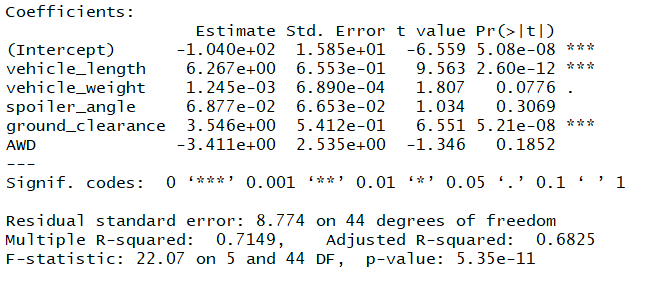
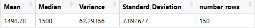
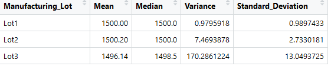
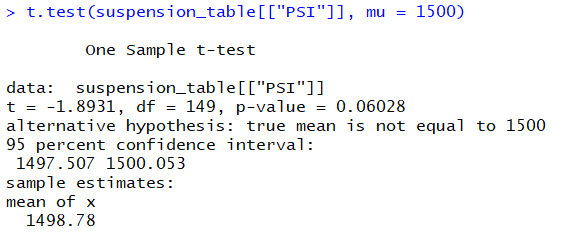
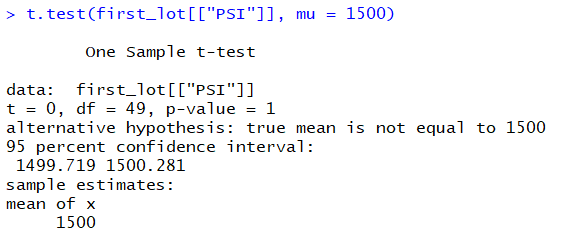
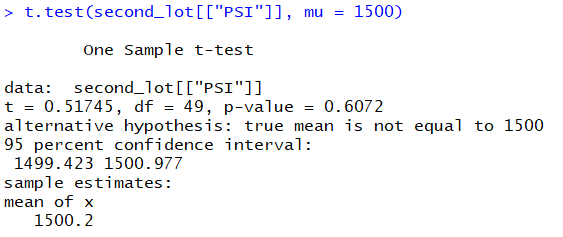

# Overview of Project:

Data is the name given to basic facts and entities such as names, numbers measurements, observations or just description of things. 
Data allows organizations to more effectively determine the cause of problems. Data allows organizations to visualize relationships between what is happening in different locations, departments, and systems. 
AutosRUs a company who rent and sale cars want to move towards the 21st century by taking data driven decision. 
Recently the most successful automobile launching utilize data analysis in every decision-making process. 
AutosRUs’ newest prototype, the MechaCar, is suffering from production troubles that are blocking the manufacturing team’s progress. Working with the data analytics team, we review the production data for insights that may help the manufacturing team.
 
To  access those insights, we will perform some statistical and technical analyse:
- Perform multiple linear regression analysis to identify which variables in the dataset predict the mpg of MechaCar prototypes.
- Collect summary statistics on the pounds per square inch (PSI) of the suspension coils from the manufacturing lots.
- Run t-tests to determine if the manufacturing lots are statistically different from the mean population.
- Design a statistical study to compare vehicle performance of the MechaCar vehicles against vehicles from other manufacturers.

# Results:

Using R-programming language, we will extract, transform and load, as well as visualize data. Then apply statistical tests.

## Linear Regression to Predict MPG (Mile Per Gallon):

- Looking at the Pr9>|t| values vehicle_length and ground_clearance are statistically likely to provide non-random amounts of variance to the MPG values in the dataset, when vehicle_weight, spoiler_angle and AWD are likely to provide random amounts of variance.
- The p-value of our linear regression analysis is 5.35e-11, which is much smaller than our assumed significance level of 0.05%. Therefore, we can state that there is sufficient evidence to reject our null hypothesis, which means that the slope of our linear model is not zero.
- According to the summary output, the r-squared value is 0.71 in our multiple linear regression model, which means roughly 71% of all MPG predictions will be correct. 
We can then say that this linear model predict MPG MechaCar prototypes effectively. 
  
## Summary Statistics on Suspension Coils:
The design specifications for the MechaCar suspension coils dictate that the variance must not exceed 100 pounds per square inch, we run a summary for all lots and then for each lot individually to measure the variance.
 
Total Summary:
 

 
Looking at the summary for all lots included, the current manufacturing data meet the design specification. The variance is ~62.29 and lower that the 100 required.
 
Lots Summary:
 

 
Looking closer at this summary, we can analyse that Lot-1 and Lot-2 variance is really low (respectively ~0.98 and ~7.47), both these Lots are meeting specifications (inferior to 100). However, Lot-3 variance is well above the criteria (~170.29).
There is an issue with Lot-3 who is not meeting the design specification. 
The total summary variance even if it keeps meeting specification is highly impacted by the high variance of Lot-3.

## T-Tests on Suspension Coils:

As the population mean should be 1,500 Pounds per square inch, we perform some test to determine if all manufacturing lots and then each lot individually are meeting this requirement.
 

 
Assuming our significance level was the common 0.05 percent, our p-value is above our significance level (0.06). Therefore, we do not have sufficient evidence to reject the null hypothesis, and we would state that the two means (1500 for the population mean and 1498.78 for the combine lots) are statistically similar.
Looking at Lot-1 and Lot-2:
 
 
 
We do not have sufficient evidence to reject the null hypothesis, and we would state that the two means(Lot-1=1500 and Lot-2=1500.02) are statistically similar and in the standard of the population mean.
 
Analysing Lot-3, we have evidence to reject the null hypothesis, the p-value (~0.04) is lower than our significance level, and we can state that the two means are statistically different (1500 > 1496.14).
 

## Study Design: MechaCar vs Competition:

In this study, we will analyse what metrics would be of interest to a consumer to quantify how the MechaCar would perform against the competition.
The cost and maintenance cost will be metrics with interested to look at.
- The null hypothesis:

Is MechaCar price correctly compared to other constructors? 
Is MechaCar maintenance cost-efficient compared to other constructors? 
 
- The alternative hypothesis:

Is MechaCar not price correctly compared to other constructors? 
Is MechaCar maintenance not cost-efficient compared to other constructors? 
  
To do this statistical analysis we will need to gather data on the price and maintenance cost from MechaCar and from a panel of others cars manufactures for comparison purposes.
Then some two sample T-test with one dichotomous independent variable (mean of price or maintenance cost for MechaCar) and one continuous dependent variable (mean of price and maintenance cost for concurents) would be used to test the hypothesis as they will give insights whether the means of two sample are statistically different.

